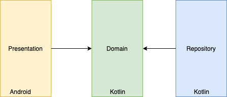

#Challenge Acme

## Scope
Design document for the challenge of Iñaki Villar.
Time spent: 5:30 hours.


## General considerations
* Main goal is implement a mobile app that uses the Flickr image search API and shows the results in a 3-column scrollable view.

* The implementation shouldn't use third-party libraries.


## Architecture
Simple layered architecture following the Solid principles.



Every layer contains their own entities that are transformed through mappers between layers:

| Layer      | Name           |
|------------|----------------|
| domain     | Photo          |
| repository | NetworkPhoto   |
| app        | PhotoViewModel |


### Domain
Core module with the definition of the use cases, entities and business logic

#### Use cases
`SearchPhotos` is the main use case defined in the app. The implementation of the interface will hold the business logic applied.

#### ADT
It has been implemented the ADT `Result` to represent the different states of the consumption of the use cases.
The error state is encapsulated within the sealed class giving more flexibility to the presenter to parse the response.

### Repository
Abstraction of the source of data for the domain layer. In the code we have only the remote source of data but should be convenient
implement local source of data(persisted) to give more flexibility at reduce dependencies on the remote layer.

#### Networking
Simple HttpURLConnection java-ish implementation encapsulated in the interface `HttpCall`. In case of using new libraries like Retrofit we need to included the new "remote" source implementation in the `PhotosRepositoryImpl`.

#### Serialization
Given the restriction of third-party libraries I have chosen work with the Kotlin serialization library

#### ADT
In this layer it has been implemented like in the domain layer an ADT to represent the states of the response: `NetworkResult`. This facilitate the ma
```
is NetworkResult.Error -> Result.Error(response.message)
is NetworkResult.HttpResult.Response -> { ... }
```


### Presentation

#### Presentation Pattern
Simple MVP with one Activity(no fragments)

Due the constraints of the third party libraries I only used this dependencies:
```
implementation("androidx.appcompat:appcompat:1.0.2")
implementation("androidx.recyclerview:recyclerview:1.0.0")
implementation("androidx.cardview:cardview:1.0.0")
```    

#### Image Caching
Implementation in memory of LRUCache with capacity of 1/4 of the available memory for the app.
`ImageController` hides the implementation details, in case in the future we want to use another library we need to plug there and not touch the adapter or view.


### Threading
Simple usage of suspending functions with Coroutines implemented in the presentation layer.

### Misc
 Providing manually  dependencies with custom components. In case in the future we want to use another library for DI or service locators we just need to update the desired dependencies in the view with the implementation details of the library

Added Unit tests for the three layers

## Missing implementations

* Configuration changes on the presentation layer with a persisted data instead of the shortcut of the Manifest

* LRU cache replication on disk

* Automation testing with Espresso for the presentation layer
